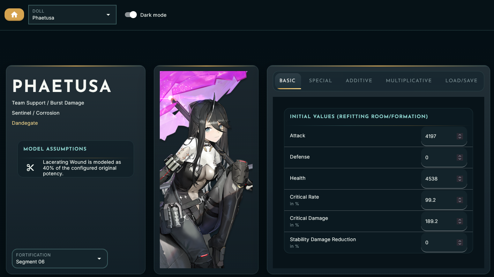
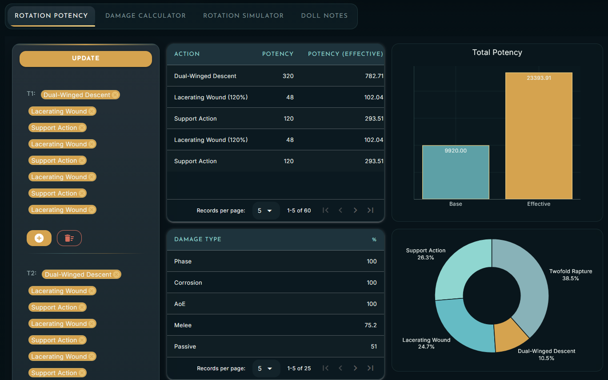
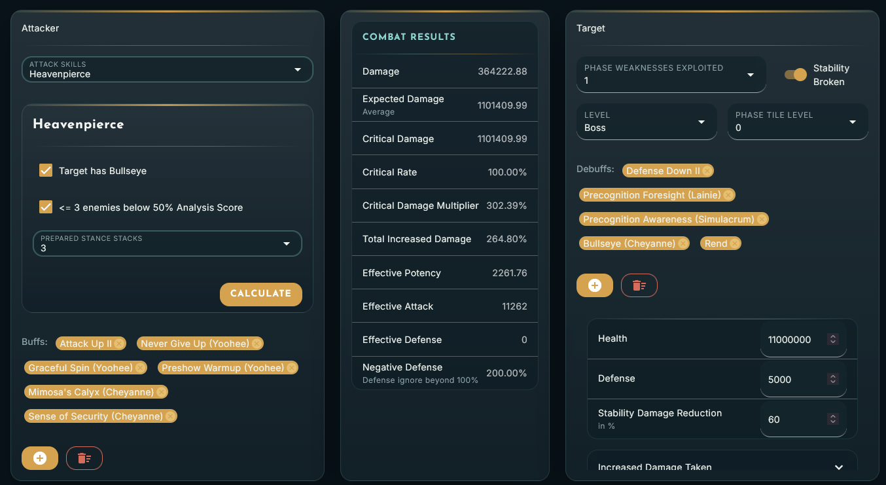
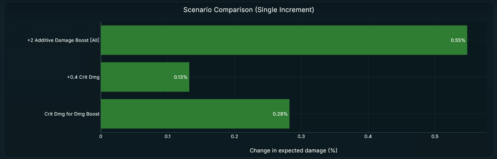
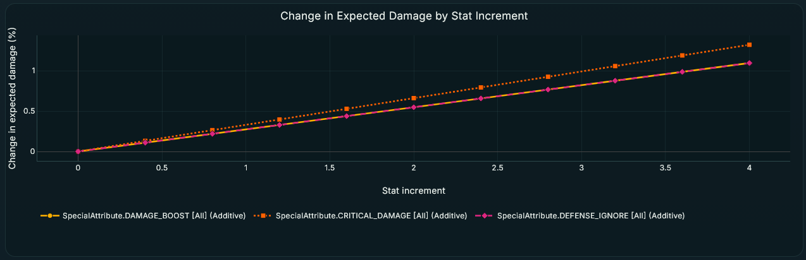
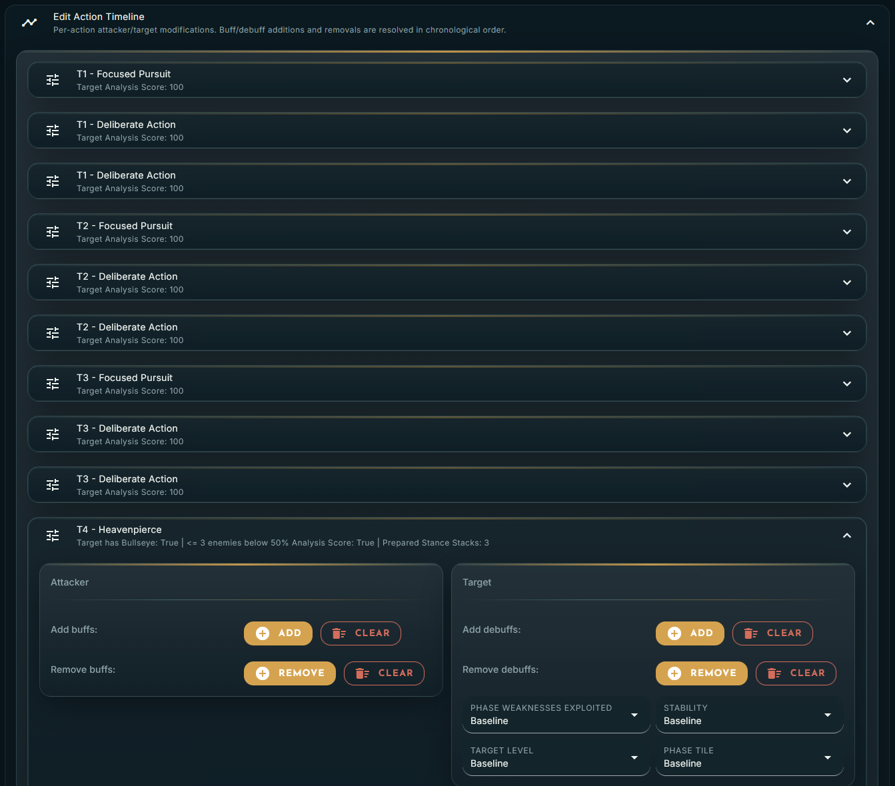
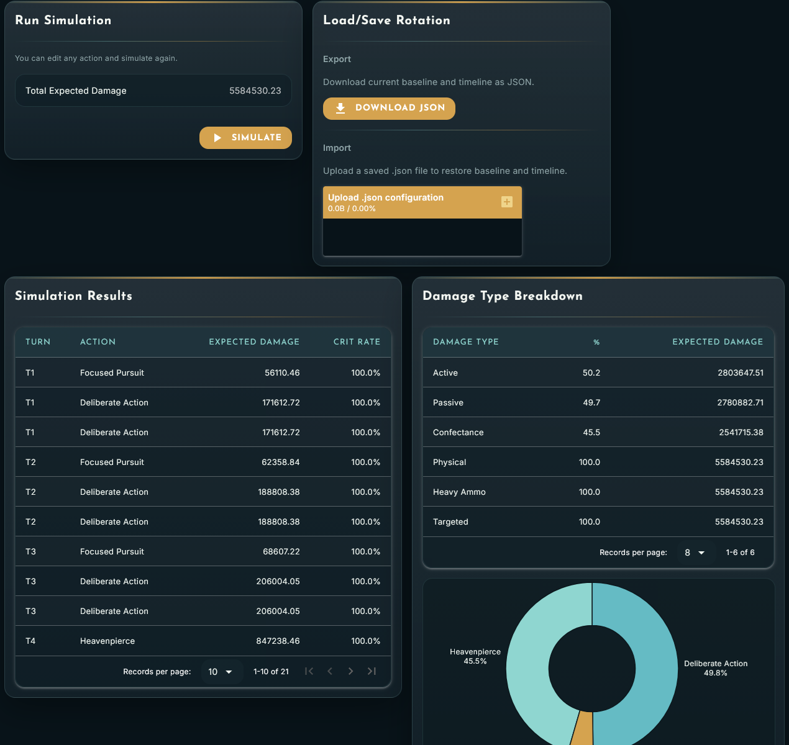

# exilium-calc

A collection of tools for simulating Doll performance in combat in Girls' Frontline 2: Exilium. 

Runs in your browser.

## Preview

Define a Doll's build by entering her stats and modifiers from weapon, attachment set, keys, remolding pattern, etc. Then use this build in the available analysis tools.



### Rotation Potency
Add a sequence of actions to define a rotation, examine the damage type breakdown, and see how the Doll's "increased damage" modifiers scale the potency of the rotation.


### Damage Calculator
Simulate the damage of a single action.


Use the Scenario Comparison and Stat Increment Analysis supplemental features to perform sensitivity analysis to estimate how changes in the Doll build would affect the same calculation.

#### Scenario Comparison
Estimate how different build changes would affect the damage calculation results. Useful for food selection, remolding pattern builds, key selection, etc.


#### Stat Increment Analysis
Estimate how the calculation results scale with different stats. Most stats scale linearly but some have non-linear behavior (e.g., physical damage + defense ignore effects). The relative slopes of different stat traces can tell you which stats are "saturated" more or less.


### Rotation Simulator
Build out an action timeline, including changes in Attacker or Target state, and estimate the total damage of the sequence.





The Scenario Comparison and Stat Increment Analysis features are also available for Rotation Simulator.

## Installation

Use `pip` to grab required packages.

```
pip install -r requirements.txt
```

## Run

From the command prompt with the python environment with the required packages activated,

```
python main.py
```

## Releases
Packaged Windows executables will periodically be made available in the Releases section. These will also run in your browser but not require Python.

## Disclaimer

This is an unofficial, fan-made project and is not affiliated with, endorsed by, or sponsored by MICA Team or Sunborn Network Technology Co., Ltd.

All game names, logos, and related assets are the property of their respective owners.